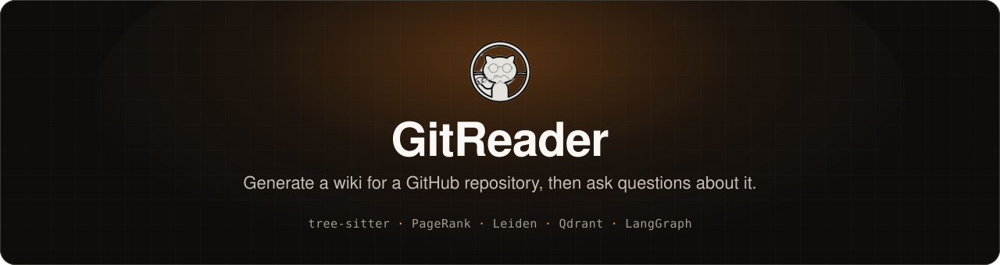

<p align="center">
  
</p>

<p align="center">
  <a href="https://github.com/rain-yyy/FAN-Tianrui-FYP/actions/workflows/backend.yml"></a>
  <a href="https://github.com/rain-yyy/FAN-Tianrui-FYP/actions/workflows/frontend.yml"></a>
</p>

GitReader is my Final Year Project, and still a work in progress. Given a GitHub repository, it parses the code, generates a wiki for it, and lets you ask follow-up questions in a chat.

You can try it at **[fyp.livelive.fun](https://fyp.livelive.fun/)**.

<!-- Screenshot: save as .github/assets/screenshot.png and uncomment.
<p align="center"></p>
-->

## How it works

- **Wiki** — the repository is parsed with tree-sitter into a code graph. PageRank and Leiden community detection on that graph decide how the wiki is organised.
- **Chat** — a LangGraph agent answers questions using tools such as code search, graph lookup and file reading, and cites the files it used.
- **Search** — a hybrid of dense embeddings and BM25, stored in Qdrant.

Built with FastAPI and Next.js, with Supabase and Cloudflare R2 for storage.

## Early results

A small evaluation so far (details in [`docker/eval/`](docker/eval/README.md)):

| | Setup | Result |
| :-- | :-- | :-- |
| Generation | 18 repositories | median 7 min, about $0.10 each |
| Retrieval | 92 questions, Recall@5 | 79.3% dense only → 83.7% hybrid + HyDE + MMR |
| Citations | 76 citations from 30 answers | 94.7% point to an existing file |

## Repository layout

```
docker/      backend (FastAPI): ingestion, wiki generation, chat agent, evaluation
frontend/    web app (Next.js)
Document/    API reference and notes
```
